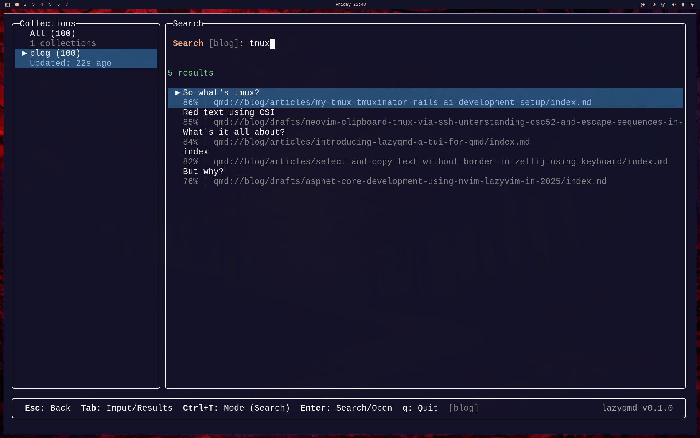
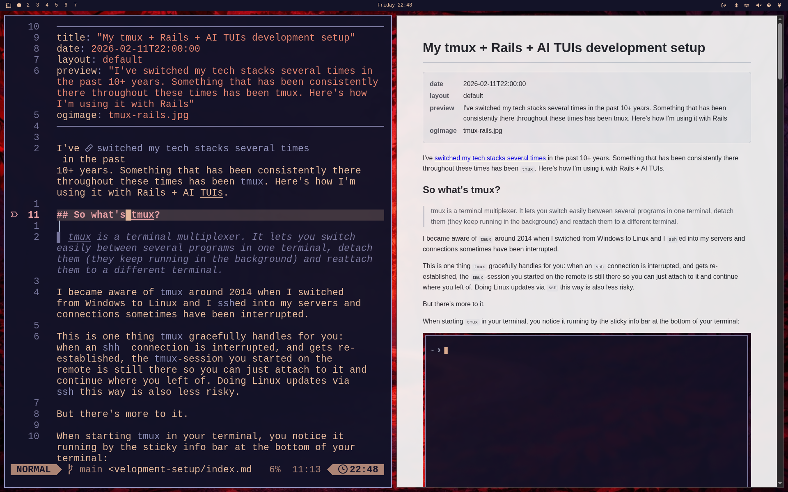
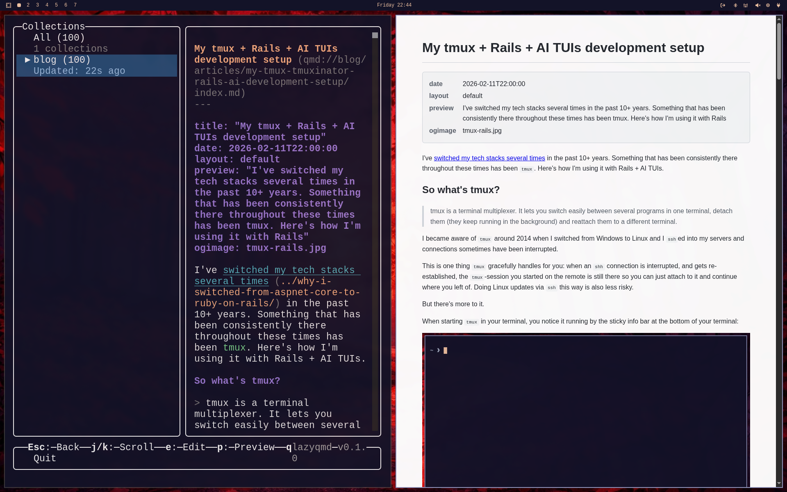

# lazyqmd

A terminal UI for browsing, searching, and previewing [qmd](https://github.com/tobi/qmd) document collections. Built with [Bun](https://bun.sh) and [@opentui/core](https://github.com/anomalyco/opentui).



## Requirements

- [Bun](https://bun.sh) runtime
- [qmd](https://github.com/tobi/qmd) CLI (v2.0.1+) installed and configured with at least one collection
- A Chromium-based browser for live preview, detected automatically in this order: `google-chrome`, `google-chrome-stable`, `chromium`, `chromium-browser`, `brave`, `brave-browser`

## Install

Global install (no source checkout needed):

```sh
bun install -g github:alexzeitler/lazyqmd
```

Then run:

```sh
lazyqmd
```

### Update

```sh
lazyqmd self-update
```

### From Source

```sh
git clone https://github.com/alexzeitler/lazyqmd.git
cd lazyqmd
bun install
bun src/index.ts
```

## Keyboard Shortcuts

### Collections (Sidebar)

| Key | Action |
|-----|--------|
| `j/k` or arrows | Navigate collections |
| `Enter` | Open collection |
| `Tab` | Switch focus between sidebar and main panel |
| `/` or `s` | Open search |
| `f` | Browse files in collection |
| `a` | Add collection |
| `d` | Delete collection |
| `r` | Rename collection |
| `x` | Edit context for selected collection |
| `c` | Run cleanup (clear caches, vacuum DB) |
| `e` | Create embeddings |
| `u` | Re-index all collections (`qmd update`) |
| `q` | Quit |

### Search

| Key | Action |
|-----|--------|
| `Enter` | Execute search / Open document |
| `Tab` | Toggle focus between input and results |
| `Ctrl+T` | Cycle search mode: Search → Vector → Query |
| `Ctrl+F` | Toggle full document output (vs. snippet) |
| `Ctrl+E` | Toggle explain (show score traces in results) |
| `Ctrl+A` | Toggle all matches (no result limit) |
| `Ctrl+S` | Cycle min-score filter: off → 0.3 → 0.5 → 0.7 → 0.9 |
| `Ctrl+L` | Cycle candidate limit: auto → 10 → 20 → 40 → 80 → 200 |
| `Esc` | Back to collections |

Search scope follows the sidebar selection — select "All" to search across all collections, or select a specific collection to scope the search.

Active search options are displayed below the search input. Enabled options are highlighted, disabled ones are dimmed.

#### Search Modes

- **Search** — Full-text BM25 keyword search (fast, no LLM)
- **Vector** — Vector similarity search (requires `qmd embed`)
- **Query** — Hybrid search with automatic query expansion and reranking (recommended, uses LLM)

#### Structured Queries

In any mode, you can type structured query prefixes directly in the search input. These are automatically routed to the Query engine:

| Prefix | Description |
|--------|-------------|
| `lex: <terms>` | BM25 keyword search |
| `vec: <terms>` | Vector similarity search |
| `hyde: <text>` | Hypothetical Document Embedding — LLM generates a hypothetical answer and searches for similar documents |
| `expand: <query>` | Explicit query expansion |

Combine multiple query types with `\n`:

```
lex: htmx\nvec: web components
```

#### Search Options

| Option | Shortcut | Description |
|--------|----------|-------------|
| **full** | `Ctrl+F` | Return full document body instead of snippet |
| **explain** | `Ctrl+E` | Show score breakdown in results (rerank score, blended score, RRF). Works best with Query mode. |
| **all** | `Ctrl+A` | Return all matches instead of top 20. Combine with min-score to filter. |
| **min-score** | `Ctrl+S` | Only show results above the threshold (0.3–0.9). Useful with `all` to get all high-quality matches. |
| **candidate limit** | `Ctrl+L` | Max candidates to rerank (default: auto/40). Lower = faster, higher = better quality. |

### Context

Each collection can have a context — a short description that helps qmd understand what the collection contains, improving query expansion and search quality.

Press `x` in the sidebar (with a collection selected) to edit the context. Enter saves, empty input deletes, Esc cancels. The current context is shown in the collection detail view.

### File Browser

| Key | Action |
|-----|--------|
| `Tab` | Toggle focus between filter and file list |
| `Enter` | Open file |
| `Esc` | Back |

Type in the filter input for fuzzy matching on file paths.

### Document

| Key | Action |
|-----|--------|
| `j/k` | Scroll |
| `e` | Open in `$EDITOR` |
| `p` | Open live preview in Chrome |
| `Esc` | Back |





### Live Preview

Pressing `p` in document view opens a rendered HTML preview in Chrome. The preview:

- Renders Markdown with frontmatter metadata
- Displays images and assets from the source directory
- Auto-reloads when the source file is saved

## Theming

lazyqmd uses [Tokyo Night](https://github.com/enkia/tokyo-night-vscode-theme) as the default color scheme. Colors are configurable and follow a three-layer cascade:

1. **Defaults** — Tokyo Night built-in
2. **Omarchy** — Auto-detected from `~/.config/omarchy/current/theme/colors.toml` (if present)
3. **Config** — User overrides in `options.json`

### Configurable Colors

Add a `theme` section to your config to override any color:

```json
{
  "mcpPort": 8181,
  "theme": {
    "accent": "#7aa2f7",
    "foreground": "#c0caf5",
    "background": "#1a1b26",
    "muted": "#565f89",
    "error": "#f7768e",
    "success": "#9ece6a",
    "warning": "#e0af68",
    "title": "#7aa2f7",
    "selection_bg": "#2a2d3e",
    "selection_fg": "#c0caf5",
    "selection_desc": "#565f89",
    "border_active": "#3b4261",
    "border_inactive": "#292e42",
    "heading": "#bb9af7",
    "strong": "#e0af68",
    "italic": "#e0af68",
    "code": "#9ece6a",
    "link": "#7dcfff",
    "link_url": "#7aa2f7",
    "list": "#7aa2f7"
  }
}
```

## Configuration

Config file: `~/.config/lazyqmd/options.json`

```json
{
  "mcpPort": 8181
}
```

## CLI

```sh
lazyqmd              # Start the TUI
lazyqmd --version    # Print version
lazyqmd self-update  # Update to latest release
```
